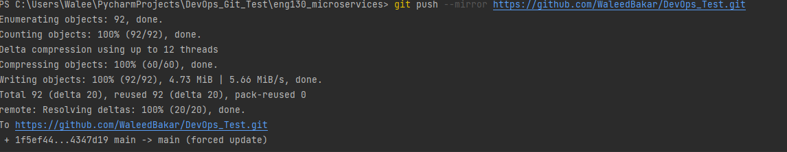

# git_theory

# How to take the contents of one git and move to another 

-Step one Create a repo on github.com. We have named ours 'DevOps_Git_Test'. 
- We now need to clone into the repo we wish to copy from by doing the following. `git clone` followed by there github link.
- You now need to `cd` into the correct place 
- once youre in the correct location simply run the following `git push --mirror` followed by your github link.
- it should look like the following. 
- !
- Now if that was successful you should be able to refresh and see the content.

# What is versioning control?

Version control is a system that records changes to a file or set of files over time so that you can recall specific versions later. It allows multiple people to work on a single project at the same time, and is often used in software development. It helps teams keep track of changes made to source code, documents, graphics, and other files. Version control systems provide a way to manage files, track changes, and revert back to prior versions of the project if needed.

# What is git?

Git is a version control system. It is a tool that tracks changes to a file or set of files over time so that you can recall specific versions later. It allows you to revert files back to a previous state, review changes made over time, and even compare versions of files. Git also makes it easy to collaborate on a project with others, allowing multiple people to work on the same project at the same time.

# Why is GIT used in devops?

Git is used in DevOps to store and manage source code, track changes, and collaborate with other developers on projects. It enables teams to work together on the same codebase, develop features in isolation, and quickly deploy features to production. It also allows developers to experiment without affecting the main codebase. This makes it easier to deploy features quickly and efficiently.